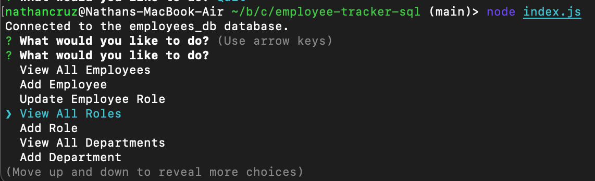
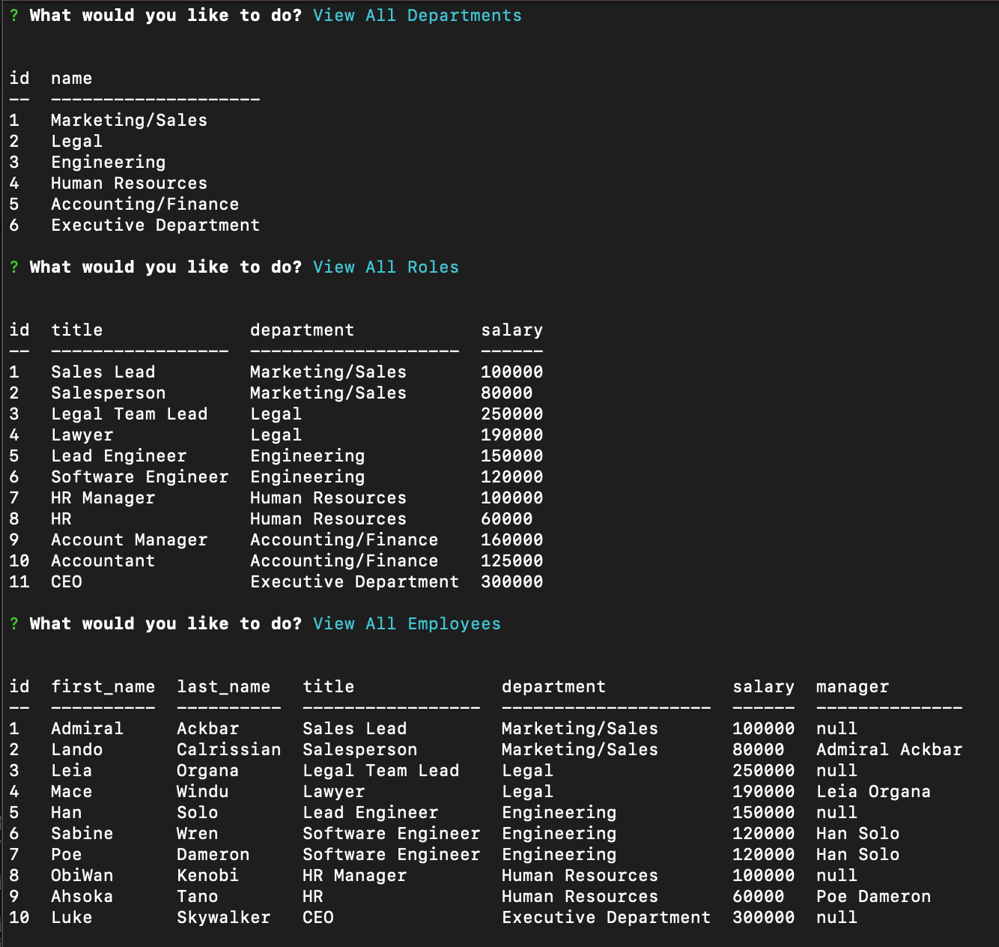

# Employee Tracker SQL

## Description
This project was a challenge assigned to us where we had to create a command-line application interface called a content management system (CMS) from scratch to manage a company's employee database, using Node.js, Inquirer, and MySQL. 

When you run the application in the Command-Line Interface, you are prompted with the following options: view all departments, view all roles, view all employees, add a department, add a role, add an employee, and update an employee role. When you choose to view either departments, roles, or employees, you will be presented with their corresponding table with information. You are also able to add a department, role, or employee, and also update an employee's role.

This challenge was similar to challenge 10 which was the team profile generator, in that we had to utilize Inquirer. This was a difficult project to me to start with no starter code. The back end continues to be a harder concept than previous ones and I am still not there yet when it comes to understanding all the syntax. Getting the roles to update was a challenge I faced but also getting the queries right in the db.js file. When it came to LEFT JOIN to join tables, that was something I had to search for a lot and ask for help on. Initially connecting all the back end to each other was difficult because I was confusing myself with names.

## User Story
```
- AS A business owner
- I WANT to be able to view and manage the departments, roles, and employees in my company
- SO THAT I can organize and plan my business
```

## Usage
This application allows users to view and manage the departments, roles, and employees in a company. Its creation is a way to practice using the CLI, JavaScript, Node.js, json packages, Inquirer, MySQL, and dependecies.

[Link to Repository](https://github.com/crzn24/employee-tracker-sql.git)

[Walkthrough Video Demo]()





## Credits
* [Inquirer.js](https://www.npmjs.com/package/inquirer/v/8.2.4)
* [console.table npm package](https://www.npmjs.com/package/console.table)
* [Node MySQL 2](https://www.npmjs.com/package/mysql2#installation)
* [SQL LEFT JOIN Keyword](https://www.w3schools.com/sql/sql_join_left.asp)
* [MySQL LEFT JOIN](https://www.mysqltutorial.org/mysql-left-join.aspx)
* [SQL INSERT INTO Statement](https://www.w3schools.com/sql/sql_insert.asp)

## License
